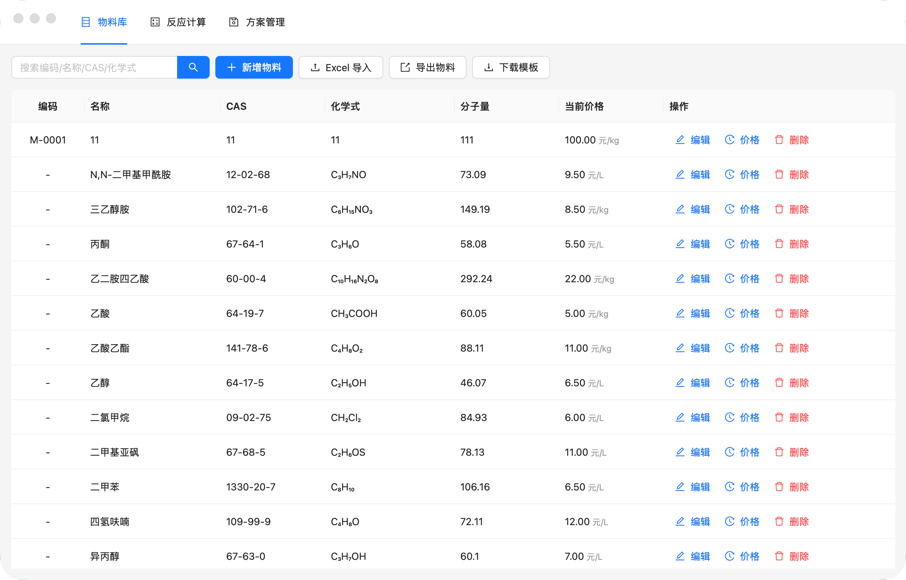
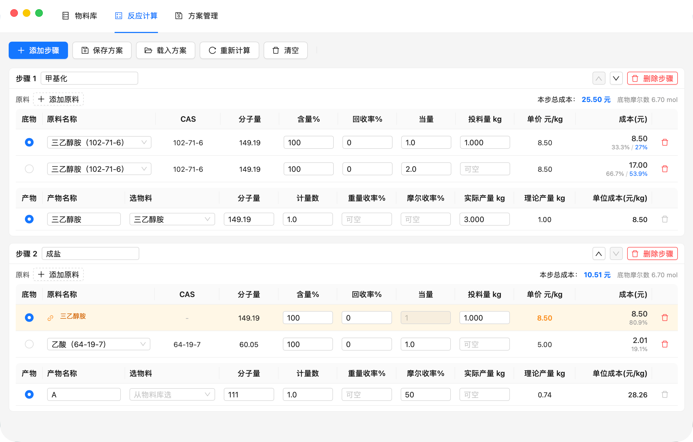
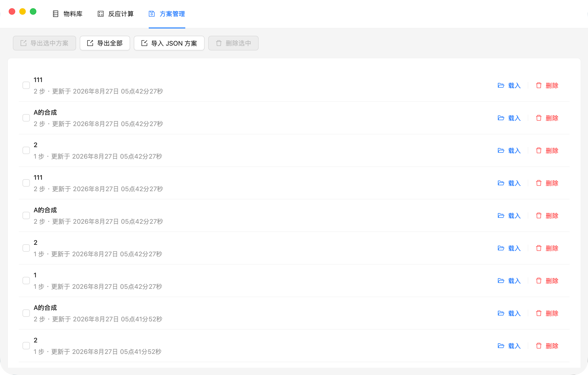

# MaterialCost · 物料成本计算

一个基于 **Wails v3 + React** 的跨平台桌面应用，用于化学反应的物料成本核算、物料与价格库管理，并支持从 Excel 批量导入物料价格。

<!-- TODO: 截图占位 —— 请将截图放入 docs/screenshots/ 后取消注释
<p align="center">
  
  
  
</p>
-->


---

## 功能特性

- **物料库管理** —— 物料的增删改查，支持按编码 / 名称 / CAS 号 / 化学式搜索。
- **价格管理** —— 每个物料的多个报价记录（供应商、规格、含量、日期）增删改查；计算时自动采用日期最新的报价，也可手动在下拉框切换。
- **反应成本计算** —— 单步与多步反应。按化学计量比与当量核算单物料成本与总投料成本；结合收率与产物分子量推算产量，进而得到产物单位重量成本。支持物料成本占比分析。
- **方案模板** —— 反应方案可保存 / 载入 / 删除，便于复用。
- **Excel 导入** —— 从 `.xlsx` 批量导入物料与价格，内置模板下载。
- **数据补全** —— 当量、投料量、收率等数据不全时，依据已有数据自动反推缺失项。
- **非阻塞校验** —— 参数不自洽时在界面标黄提示，但不阻止保存与计算，允许人工覆盖。

## 技术栈

| 层 | 技术 |
|----|------|
| 桌面框架 | [Wails v3](https://v3alpha.wails.io/) (`v3.0.0-beta.12`) |
| 后端 | Go 1.25 |
| 前端 | React 18 + TypeScript + Vite 8 |
| UI 组件 | [Ant Design 6](https://ant.design/) |
| 数据库 | SQLite（[`modernc.org/sqlite`](https://gitlab.com/cznic/sqlite)，纯 Go，免 CGO） |
| Excel | [`github.com/xuri/excelize/v2`](https://github.com/qax-os/excelize) |

选型说明：SQLite 驱动使用纯 Go 实现，因此交叉编译各平台时无需 C 工具链。

## 架构总览

```
┌──────────────────────────────────────────────────────┐
│                   Wails v3 应用                       │
│                                                      │
│  ┌───────────────┐     绑定调用      ┌─────────────┐  │
│  │  React 前端    │ ◄──────────────► │  Go 后端     │  │
│  │  Ant Design   │                  │  Service 层  │  │
│  │   + Vite      │                  │             │  │
│  └───────────────┘                  └──────┬──────┘  │
│                                            │         │
│                              ┌─────────────┴──────┐  │
│                              │  engine 计算引擎     │  │
│                              │  (纯函数，可单测)     │  │
│                              └─────────────┬──────┘  │
│                                            │         │
│                                 ┌──────────▼──────┐  │
│                                 │  SQLite 数据库    │  │
│                                 └─────────────────┘  │
└──────────────────────────────────────────────────────┘
```

**架构约束**：前端只做展示与输入，所有业务逻辑（计算、校验、持久化）都在 Go 后端。前端通过 Wails 自动生成的 TS 绑定调用后端服务，绑定代码位于 `frontend/bindings/`，由 `wails3 generate bindings` 生成 —— **请勿手工编辑**。

## 下载安装

前往 [Releases](https://github.com/dongying1997/materialcost4/releases) 下载对应平台的安装包：

| 平台 | 文件 |
|------|------|
| macOS（Intel + Apple 芯片通用） | `materialcost4-macos-universal.dmg` |
| Windows (x64) | `materialcost4-windows-amd64-setup.exe` |
| Linux (Debian / Ubuntu) | `materialcost4-linux-amd64.deb` |
| Linux (Fedora / RHEL) | `materialcost4-linux-x86_64.rpm` |

安装包未做代码签名：macOS 首次打开需右键选「打开」；Windows 可能弹出 SmartScreen 提示，选「更多信息 → 仍要运行」。

## 快速开始

### 前置依赖

| 依赖 | 版本 | 安装 |
|------|------|------|
| Go | 1.25+ | `brew install go` |
| Node.js | 20+ | `brew install node` |
| Wails CLI | v3.0.0-beta.12 | `go install github.com/wailsapp/wails/v3/cmd/wails3@latest` |
| Task | 3.x（实验证版本 3.53.1） | `brew install go-task`（`wails3 build` / `wails3 package` 依赖） |

> Wails v3 目前仍是 beta，请确保 CLI 版本与 `go.mod` 中的 `v3.0.0-beta.12` 一致，否则绑定生成可能不兼容。
>
> 各平台的打包配置与图标（`build/`）已随仓库分发，克隆后即可直接构建，无需 `wails3 init`。

### 构建与运行

```bash
git clone https://github.com/dongying1997/materialcost4.git
cd materialcost4

# 1. 安装前端依赖
cd frontend && npm install && cd ..

# 2. 开发模式（前端热重载，Vite 监听 9245 端口）
wails3 dev

# 3. 生产构建
wails3 build

# 4. 运行后端测试
go test ./...

# 5. 打当前平台的安装包（macOS 出 .dmg，Windows 出安装程序，Linux 出 deb/rpm）
wails3 package

# 6.（可选）修改 Go 模型或服务后，重新生成前端绑定
wails3 generate bindings -ts -i
```

也可以直接 `wails3 task darwin:package:dmg` 等按平台打包。发布新版本的流程见 [CONTRIBUTING.md](CONTRIBUTING.md#发布版本)。

应用数据（SQLite 数据库）存放在系统用户数据目录下，不随仓库分发：

| 平台 | 路径 |
|------|------|
| macOS | `~/Library/Application Support/MaterialCost4/materialcost.db` |
| Windows | `%APPDATA%\MaterialCost4\materialcost.db` |
| Linux | `~/.config/MaterialCost4/materialcost.db` |

## 计算引擎

单位统一为 **kg** 与 **元/kg**：

| 原始单位 | 换算方式 |
|----------|----------|
| 元/g → 元/kg | ×1000 |
| 元/mol → 元/kg | ×1000 ÷ 分子量 |
| g → kg | ÷1000 |

### 单步反应

指定一个底物作为 1 eq 基准：

```
底物有效摩尔数    n₀ = 投料量(kg) × 含量% × 1000 ÷ 分子量

其他物料（当量与投料量至少有一个不为空）：
  当量不为空时：
    摩尔数      = n₀ × 当量
    投料量(kg)  = 理论摩尔 × 分子量 ÷ (含量% × 1000)
    成本        = 实际投料量(kg) × 单价(元/kg) × (1 - 回收率%)
  投料量不为空时：
    摩尔数 = 投料量(kg) × 1000 ÷ 分子量
    成本   = 实际投料量(kg) × 单价(元/kg) × (1 - 回收率%)

本步总成本 = 所有物料成本之和

产物（重量收率、摩尔收率、实际产量至少有一个不为空）：
  单位成本(元/kg) = 本步总成本 ÷ 产量(kg)

  产量不为空：
    重量收率 = 产量 ÷ 底物投料量
    摩尔收率 = (产量 ÷ 产物分子量) ÷ (底物投料量 ÷ 底物分子量)
  重量收率不为空：
    产量     = 投料量 × 重量收率
    摩尔收率 = (产量 ÷ 产物分子量) ÷ (底物投料量 ÷ 底物分子量)
  摩尔收率不为空：
    产量     = (底物投料量 ÷ 底物分子量) × 摩尔收率 × 产物分子量
    重量收率 = 产量 ÷ 底物投料量
```

### 多步反应

按步骤顺序依次计算，中间产物自动向下游传递 —— 上一步产物的「单位成本 + 实际产量 + 分子量」作为下一步继承原料的「单价 + 分子量」；下一步的投料量仍可人工编辑。

### 校验规则

**阻塞性校验（必须满足才能计算）**

1. 当量与投料量至少有一个不为空。
2. 摩尔收率、重量收率、实际产量至少有一个不为空。

**自动补全**

1. 当量与投料量有一个为空时，由另一个反推。
2. 摩尔收率、重量收率、实际产量有空缺时，由其余数据反推。

**非阻塞警告（黄标提示，不阻止操作）**

1. 实际投料量 ↔ 由当量反推的理论投料量，偏差 > 1%。
2. 摩尔收率 ↔ 重量收率不一致（考虑含量）。
3. 实际产量 ↔ 填写的收率不一致。
4. 价格单位为 元/mol 但缺少分子量。

## Excel 导入规则

模板列：

```
物料名称 | CAS号 | 化学式 | 分子量 | 价格 | 价格单位 | 单供应商 | 日期 | 规格 | 含量 | 备注
```

- 表头按别名容错匹配；**CAS 号必填**。
- 按 CAS 号导入物料：已存在的 CAS 会更新其「物料名称 / CAS号 / 化学式 / 分子量」。
- 其余列写入价格记录：价格、价格单位、供应商、日期、规格、含量、备注。
- 日期同时支持字符串（`2026-08-25`）与 Excel 序列号。

## 项目结构

```
├── main.go                  # 入口：装配 DB、Service 与 Wails 运行时
├── internal/                # Go 后端（全部业务逻辑）
│   ├── db/                  #   SQLite 连接与仓储层
│   ├── engine/              #   纯函数计算引擎（单元测试主战场）
│   ├── models/              #   共享数据模型
│   └── service/             #   对外暴露的 Wails 服务（CRUD、Excel 读写）
├── frontend/
│   ├── src/
│   │   ├── components/      #   可复用 UI 组件（PascalCase.tsx）
│   │   ├── pages/           #   顶层页面组件
│   │   ├── hooks/           #   自定义 hooks（useXxx.ts）
│   │   └── utils/           #   前端工具函数
│   └── bindings/            #   自动生成的 Wails TS 绑定（勿手改）
├── build/                   # 各平台打包配置（由 wails3 管理）
└── Taskfile.yml             # 构建任务定义
```

## 贡献

欢迎提交 Issue 与 Pull Request。开发规范、编码风格与提交信息约定请见 [CONTRIBUTING.md](CONTRIBUTING.md)。

## 许可

本项目**尚未添加开源许可证**。在添加许可证之前，依据著作权法默认保留所有权利，他人无权使用、修改或分发本项目的代码。若你希望以开源方式使用本项目，欢迎提 Issue 讨论合适的许可证。
